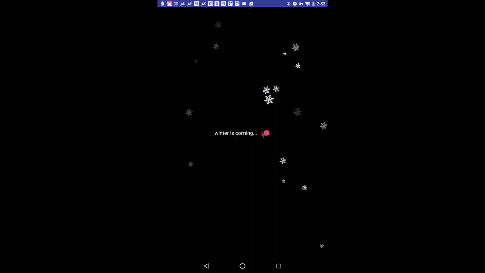

# SnowingView 

## winter is coming...

## 介绍
一个**看起来还不错**的下雪动画。

## 功能&&实现
1. 使用 Matrix 产生随机大小、透明度的雪花
2. 使用 HandlerThread 来计算雪花的下一个位置
3. 使用**加速度传感器**判断用户在 X 轴的倾斜方向，使雪花产生左右飘动的效果

## 缺点&改进
1. 还未用 LeakCanary 检测是否有内存泄漏的情况
2. 暂时还不支持 **wrap_content**
3. 可能会采用 SurfaceView 来绘制提高效率

## 实际效果

## 参考
- 之前在开发者看到的 [Android下雪动画](http://www.devtf.cn/?p=1268)，但是，我并没有看懂作者的[雪花下落算法](http://www.openprocessing.org/sketch/84771)
